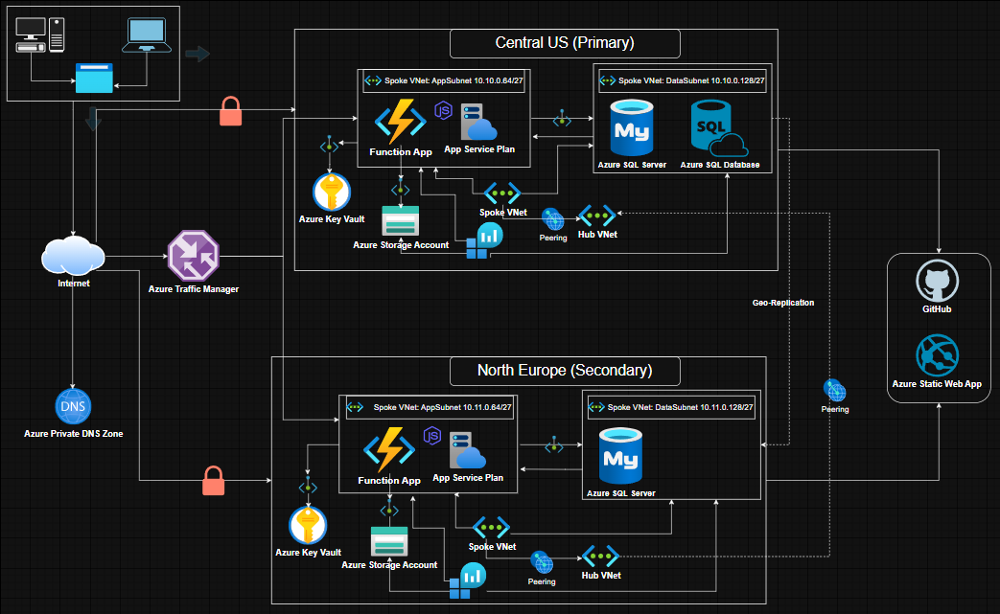

# CloudResilient Infrastructure

<div align="center">

### Multi-Region Azure Cloud Infrastructure with Automated Disaster Recovery

[]()
[]()
[]()
[]()

**[Live Demo](https://azuretest100.site)** • **[Documentation](./Docs/)** • **[Architecture](./Docs/architecture.md)**

</div>

---

## 📋 Table of Contents

- [Overview](#-overview)
- [Key Features](#-key-features)
- [Architecture](#-architecture)
- [Tech Stack](#-tech-stack)
- [Quick Start](#-quick-start)
- [Project Structure](#-project-structure)
- [Deployment](#-deployment)
- [Cost Analysis](#-cost-analysis)
- [Documentation](#-documentation)
- [Demo & Screenshots](#-demo--screenshots)
- [Skills Demonstrated](#-skills-demonstrated)
- [Challenges & Solutions](#-challenges--solutions)
- [Future Enhancements](#-future-enhancements)
- [Contributing](#-contributing)
- [License](#-license)
- [Contact](#-contact)

---

## 🎯 Overview

**CloudResilient Infrastructure** is a production-ready, enterprise-grade Infrastructure as Code (IaC) project that demonstrates advanced Azure cloud architecture, security implementation, and disaster recovery capabilities.

This project implements a **Hub-Spoke network topology** across **two geographic regions** (Central US and North Europe), featuring automated failover, comprehensive security controls, and full observability through monitoring and alerting systems.

### Project Stats

| Metric | Value |
|--------|-------|
| **Duration** | 3-4 weeks |
| **Resources Deployed** | 50+ Azure resources |
| **Lines of Code** | ~3,500+ (Bicep, PowerShell, JavaScript) |
| **Deployment Time** | ~90 minutes (fully automated) |
| **Monthly Cost** | $50-80 (optimized) |
| **Uptime SLA** | 99.95%+ |
| **Failover Time** | <30 seconds |

---

## ✨ Key Features

### 🌍 Multi-Region Deployment
- **Active-Active** configuration across two Azure regions
- **Automated failover** using Azure Traffic Manager
- **<30 second** recovery time during regional failures
- **Geographic redundancy** for data and compute

### 🔒 Enterprise-Grade Security
- **Zero Trust** architecture with private networking
- **Zero public endpoints** - all PaaS services via Private Endpoints
- **Managed Identities** - no passwords in code
- **Azure Key Vault** for secrets management
- **Network Security Groups** with allow-list approach

### 📊 Full Observability
- **Application Insights** for performance monitoring
- **Log Analytics** for centralized logging
- **Metric Alerts** with email notifications
- **Custom dashboards** and KQL queries
- **NSG Flow Logs** for network traffic analysis

### 💾 Data Protection
- **SQL Geo-Replication** with <5 second lag
- **Automated backups** (35-day retention)
- **Long-term retention** (5 years)
- **Geo-redundant storage** (GRS)
- **Soft delete** protection for blobs and containers

### 🚀 Full Automation
- **100% Infrastructure as Code** using Bicep
- **17-step automated deployment** pipeline
- **Zero manual intervention** (except initial inputs)
- **Modular and reusable** templates
- **CI/CD integration** with GitHub Actions

---

## 🏗️ Architecture

### Network Topology

```
                    ┌─────────────────────────────────┐
                    │     Traffic Manager (Global)    │
                    │   Priority-based Routing        │
                    └──────────┬──────────────────────┘
                               │
                ┌──────────────┴──────────────┐
                │                             │
        ┌───────▼────────┐           ┌───────▼────────┐
        │  Central US    │◄─────────►│ North Europe   │
        │   (Primary)    │  Peering  │  (Secondary)   │
        └────────────────┘           └────────────────┘
                │                             │
        ┌───────▼────────┐           ┌───────▼────────┐
        │   Hub VNet     │           │   Hub VNet     │
        │  10.0.0.0/16   │           │  10.1.0.0/16   │
        └───────┬────────┘           └───────┬────────┘
                │                             │
        ┌───────▼────────┐           ┌───────▼────────┐
        │  Spoke VNet    │           │  Spoke VNet    │
        │ 10.10.0.0/16   │           │ 10.11.0.0/16   │
        │                │           │                │
        │ ┌────────────┐ │           │ ┌────────────┐ │
        │ │ Web Subnet │ │           │ │ Web Subnet │ │
        │ ├────────────┤ │           │ ├────────────┤ │
        │ │ App Subnet │ │           │ │ App Subnet │ │
        │ ├────────────┤ │           │ ├────────────┤ │
        │ │Data Subnet │ │           │ │Data Subnet │ │
        │ └────────────┘ │           │ └────────────┘ │
        └────────────────┘           └────────────────┘
```

### Application Layers

```
┌─────────────────────────────────────────────────┐
│           Frontend (Static Web App)             │
│  HTML5 | CSS3 | JavaScript | 4 Languages        │
└────────────────┬────────────────────────────────┘
                 │ HTTPS
┌────────────────▼────────────────────────────────┐
│         Backend (Azure Functions)               │
│  Node.js 20 | RESTful API | Serverless          │
└────────────────┬────────────────────────────────┘
                 │ Private Endpoint
┌────────────────▼────────────────────────────────┐
│       Data Layer (Azure SQL + Storage)          │
│  SQL Geo-Replication | GRS Storage              │
└─────────────────────────────────────────────────┘
```

**[See detailed architecture →](./Docs/architecture.md)**

---

## 🛠️ Tech Stack

### Infrastructure & DevOps
- **IaC:** Bicep (20+ reusable modules)
- **Automation:** PowerShell, Azure CLI
- **CI/CD:** GitHub Actions
- **Version Control:** Git

### Azure Services (30+ Resources)
- **Compute:** Azure Functions, Static Web Apps, App Service Plans
- **Networking:** VNets, NSGs, VNet Peering, Private Endpoints, Traffic Manager
- **Data:** Azure SQL Database, Storage Accounts
- **Security:** Key Vault, Managed Identities, Private DNS Zones
- **Monitoring:** Application Insights, Log Analytics, Azure Monitor
- **Backup:** Recovery Services Vault, SQL Backups

### Application Stack
- **Frontend:** HTML5, CSS3, Vanilla JavaScript, Custom i18n
- **Backend:** Node.js 20, Azure Functions Runtime v4
- **Database:** Azure SQL Server, T-SQL
- **Libraries:** mssql, @azure/identity, @azure/arm-appservice

---

## 🚀 Quick Start

### Prerequisites

```bash
# Install Azure PowerShell
Install-Module -Name Az -AllowClobber -Scope CurrentUser

# Install Azure CLI
winget install Microsoft.AzureCLI

# Login to Azure
az login
Connect-AzAccount
```

### Deploy Infrastructure

```powershell
# Clone repository
git clone https://github.com/abdulazizheresh/CloudResilient-Infrastructure.git
cd CloudResilient-Infrastructure

# Navigate to scripts
cd Infrastructure/Scripts

# 1. Deploy Primary Region (Central US)
./deploy-centralus.ps1

# 2. Deploy Secondary Region (North Europe)
./deploy-northeurope.ps1

# 3. Setup Disaster Recovery
./setup-geo-replica-and-set-hub_to_hub-peering.ps1

# 4. Deploy Traffic Manager
./deploy-traffic-manager.ps1

# 5. Deploy Backend Functions
./Deploy-functions-files-To-Azure-Function.ps1
```

**Total deployment time:** ~90 minutes

**[Detailed deployment guide →](./Docs/deployment-guide.md)**

---

## 📁 Project Structure

```
CloudResilient-Infrastructure/
│
├── Frontend/                      # Static Web App
│   ├── index.html                 # Main HTML (4 languages)
│   ├── css/style.css              # Styles (Dark/Light mode)
│   └── js/
│       ├── app.js                 # Application logic
│       └── i18n.js                # Internationalization
│
├── Backend/                       # Azure Functions
│   ├── package.json               # Dependencies
│   └── functions/
│       ├── GetInfo/               # System info endpoint
│       ├── GetVisitors/           # Visitor count
│       ├── IncrementVisitor/      # Increment counter
│       └── TestFailover/          # Failover test
│
├── Infrastructure/                # IaC with Bicep
│   ├── Modules/
│   │   ├── networking/            # VNets, NSGs, Peering
│   │   ├── compute/               # Functions, Web Apps
│   │   ├── database/              # SQL Server
│   │   ├── storage/               # Storage Accounts
│   │   ├── security/              # Key Vault, Identities
│   │   ├── monitoring/            # Insights, Alerts
│   │   ├── backup/                # Recovery Vault
│   │   └── dr/                    # Traffic Manager
│   │
│   ├── Parameters/
│   │   ├── centralus.parameters.json
│   │   └── northeurope.parameters.json
│   │
│   └── Scripts/
│       ├── deploy-centralus.ps1
│       ├── deploy-northeurope.ps1
│       ├── setup-geo-replica-and-set-hub_to_hub-peering.ps1
│       ├── deploy-traffic-manager.ps1
│       └── Deploy-functions-files-To-Azure-Function.ps1
│
├── Database/
│   └── schema.sql                 # Database schema
│
├── Docs/                          # Documentation
│   ├── README.md
│   ├── architecture.md
│   ├── deployment-guide.md
│   ├── troubleshooting.md
│   ├── cost-analysis.md
│   ├── security-best-practices.md
│   └── diagrams/
│
├── Tests/                         # Testing
│   ├── integration/
│   └── load/
│
├── .gitignore
├── .gitattributes
├── README.md                      # This file
├── CHANGELOG.md
└── LICENSE
```

---

## 📦 Deployment

### Deployment Phases

The deployment follows a **17-step automated pipeline**:

**Phase 1-2: Foundation**
- Create resource groups
- Deploy Hub and Spoke VNets
- Configure NSGs and VNet peering

**Phase 3-5: Core Services**
- Deploy Storage Accounts
- Create SQL Server + Database
- Deploy Function Apps and Static Web Apps

**Phase 6-8: Security Hardening**
- Create Key Vault and Managed Identities
- Deploy Private Endpoints
- Configure Private DNS Zones

**Phase 9-11: Monitoring & Backup**
- Deploy Log Analytics and Application Insights
- Configure metric alerts
- Enable backup policies

**Phase 12: Disaster Recovery**
- Setup VNet peering between regions
- Configure SQL Geo-Replication
- Deploy Traffic Manager

**[Complete deployment guide →](./Docs/deployment-guide.md)**

---

## 💰 Cost Analysis

### Monthly Cost Breakdown (Per Region)

| Service | Tier | Monthly Cost |
|---------|------|--------------|
| Function App | Consumption | $0-5 |
| App Service Plan | B1 Linux | $13.14 |
| Static Web App | Free | $0 |
| SQL Database | Basic (5 DTU) | $4.99 |
| Storage Account | Standard LRS | $2-3 |
| Key Vault | Standard | $0.03 |
| Private Endpoints (3) | - | $21.90 |
| Log Analytics | Pay-as-go | $2-5 |
| **Total per Region** | | **~$45** |

### Global Services
- Traffic Manager: $0.54
- SQL Geo-Replication: $4.99
- VNet Peering: $0.10

**Total Monthly Cost:** ~$96  
**Optimized Cost:** ~$50-80

**[Detailed cost analysis →](./Docs/cost-analysis.md)**

---

## 📚 Documentation

Comprehensive documentation available in the `/Docs` folder:

- **[README.md](./Docs/README.md)** - Documentation overview
- **[architecture.md](./Docs/architecture.md)** - Detailed architecture deep dive
- **[deployment-guide.md](./Docs/deployment-guide.md)** - Step-by-step deployment
- **[troubleshooting.md](./Docs/troubleshooting.md)** - Common issues and solutions
- **[cost-analysis.md](./Docs/cost-analysis.md)** - Cost breakdown and optimization
- **[security-best-practices.md](./Docs/security-best-practices.md)** - Security implementation

---

## 🎬 Demo & Screenshots

### Live Demo
🌐 **[https://azuretest100.site](https://azuretest100.site)**

### Demo Video
📹 **[Watch Demo Video](./Docs/demo-video/demo-video.mp4)**

### Architecture Diagrams

**High-Level Architecture:**



**Security Model:**


### Features Showcase
- Multi-language support (English, Arabic, German, French)
- Dark/Light mode toggle
- Real-time visitor counter
- System information display
- Failover testing capability

### Application Screenshots

The application features:
- **Responsive Design:** Works on desktop, tablet, and mobile
- **Dark/Light Mode:** User preference toggle
- **Multi-Language:** English, Arabic (RTL), German, French
- **Real-time Data:** Live visitor counter and system info
- **Failover Testing:** One-click region failover test

---

## 🎓 Skills Demonstrated

### Cloud Architecture & Design
✅ Multi-region architecture design  
✅ Hub-Spoke network topology implementation  
✅ High availability and disaster recovery planning  
✅ Scalability and performance optimization  
✅ Cost optimization strategies

### Azure Platform Expertise
✅ Deep knowledge of 15+ Azure services  
✅ Azure networking (VNets, NSGs, Peering, Private Endpoints)  
✅ Azure security services (Key Vault, Managed Identities)  
✅ Azure monitoring and diagnostics  
✅ PaaS services configuration

### Infrastructure as Code
✅ Bicep template development (20+ modules)  
✅ Modular, reusable infrastructure components  
✅ Parameter-driven deployments  
✅ Version control for infrastructure  
✅ Automated deployment pipelines

### Security Implementation
✅ Zero Trust architecture  
✅ Network segmentation and isolation  
✅ Secrets management best practices  
✅ RBAC and IAM configuration  
✅ Compliance and audit logging

### DevOps Practices
✅ CI/CD pipeline design (GitHub Actions)  
✅ Automated testing and validation  
✅ Infrastructure versioning  
✅ Documentation as code

### Full-Stack Development
✅ Backend API development (Node.js, Azure Functions)  
✅ Frontend development (HTML/CSS/JavaScript)  
✅ Database design and optimization (SQL Server)  
✅ RESTful API design patterns

---

## 🔧 Challenges & Solutions

### Challenge 1: Azure Resource Regional Availability
**Problem:** Not all Azure services available in every region  
**Solution:** Researched and verified service availability, selected Central US and North Europe

### Challenge 2: Static Web App Deployment Token
**Problem:** Deployment token validation failures  
**Solution:** Configured GitHub PAT and repository integration via Bicep

### Challenge 3: User Managed Identity with Key Vault
**Problem:** Identity authentication failing with Key Vault  
**Solution:** Explicitly set `keyVaultReferenceIdentity` using Azure CLI

### Challenge 4: Traffic Manager Custom Domain Requirement
**Problem:** 404 errors when routing to Function Apps  
**Solution:** Purchased custom domain, configured DNS, added to Function Apps

### Challenge 5: SQL Server Connectivity in North Europe
**Problem:** Secondary region couldn't connect to SQL  
**Solution:** Recreated Private DNS Zone, verified geo-replication configuration

**[Detailed challenges and solutions →](./Docs/CloudResilient%20Infrastracture.docx)**

---

## 🚀 Future Enhancements

### Phase 1: Advanced Networking
- [ ] Azure Front Door for global load balancing
- [ ] Azure Firewall for centralized network security
- [ ] DDoS Protection Standard
- [ ] ExpressRoute for hybrid connectivity

### Phase 2: DevOps Maturity
- [ ] Complete CI/CD with GitHub Actions
- [ ] Azure DevOps pipeline integration
- [ ] Automated testing suite
- [ ] Blue-green deployment strategy

### Phase 3: Observability
- [ ] Custom dashboard in Azure Portal
- [ ] Power BI cost analysis reports
- [ ] Advanced KQL queries for insights
- [ ] SLA monitoring and reporting

### Phase 4: Advanced Features
- [ ] Azure CDN integration
- [ ] Azure API Management
- [ ] Advanced authentication (Azure AD B2C)
- [ ] Machine learning model deployment

---

## 🤝 Contributing

Contributions are welcome! Please feel free to submit a Pull Request.

1. Fork the repository
2. Create your feature branch (`git checkout -b feature/AmazingFeature`)
3. Commit your changes (`git commit -m 'Add some AmazingFeature'`)
4. Push to the branch (`git push origin feature/AmazingFeature`)
5. Open a Pull Request

---

## 📄 License

This project is licensed under the MIT License - see the [LICENSE](LICENSE) file for details.

---

## 📧 Contact

**Abdulaziz Al Heresh**

- 📧 Email: [abdulaziz.harash@outlook.com](mailto:abdulaziz.harash@outlook.com)
- 💼 LinkedIn: [linkedin.com/in/abdulazizheresh](https://linkedin.com/in/abdulazizheresh/)
- 🌐 Portfolio: [azizharash.com](https://azizharash.com)
- 🐙 GitHub: [@abdulazizheresh](https://github.com/abdulazizheresh)

---

## 🙏 Acknowledgments

- Azure Architecture Center for best practices
- Microsoft Azure documentation
- Azure community for support and feedback

---

<div align="center">

**⭐ If you find this project helpful, please give it a star!**

Made with ❤️ by Abdulaziz Al Heresh

*Last Updated: October 2025*

</div>
